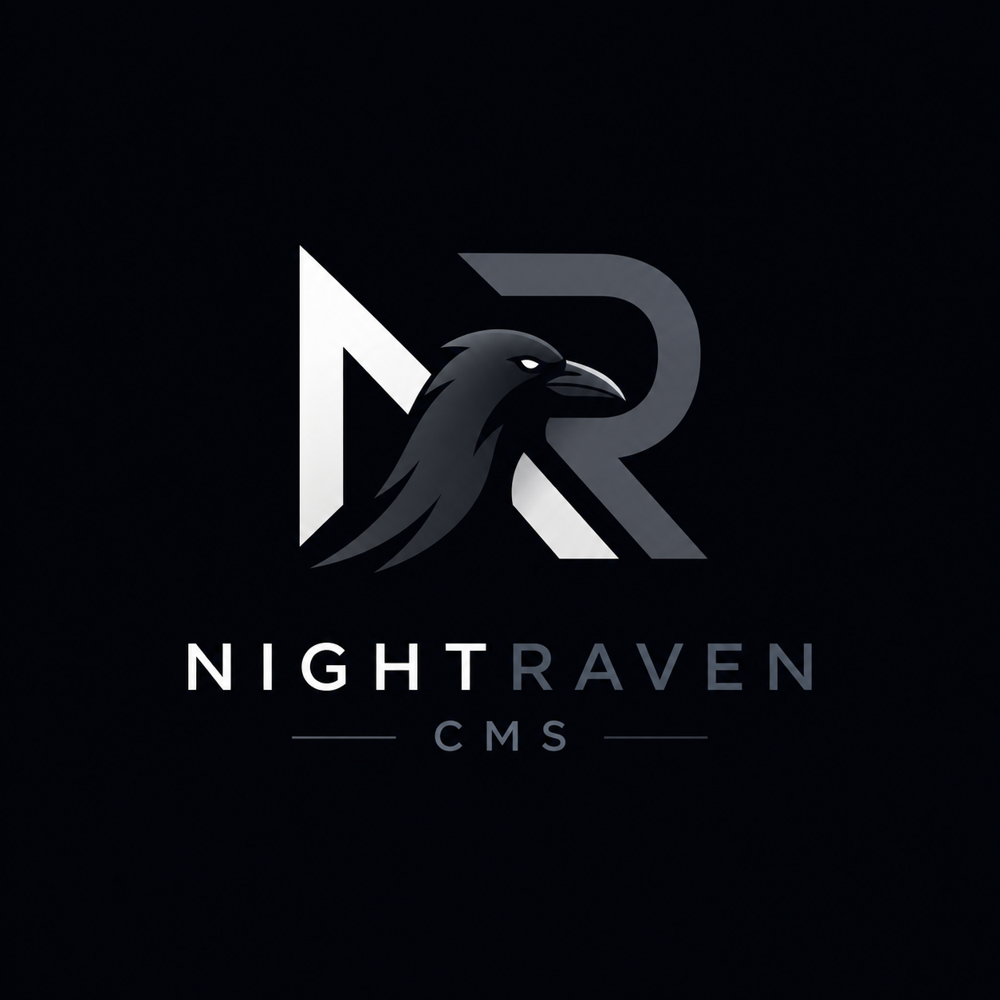

This is a [Next.js](https://nextjs.org) project bootstrapped with [`create-next-app`](https://nextjs.org/docs/app/api-reference/cli/create-next-app).

## Getting Started

First, run the development server:

```bash
npm run dev
# or
yarn dev
# or
pnpm dev
# or
bun dev
```

Open [http://localhost:3000](http://localhost:3000) with your browser to see the result.

## Environment Variables

| Variable                                                              | Description                                                                                                                                   | Required         |
| --------------------------------------------------------------------- | --------------------------------------------------------------------------------------------------------------------------------------------- | ---------------- |
| `DATABASE_URL`                                                        | Postgres connection string. A Neon HTTP URL (`postgresql://...neon.tech/...`) takes the optimal serverless path; any Postgres works.          | ✅               |
| `NEXT_PUBLIC_CLERK_PUBLISHABLE_KEY`                                   | Clerk frontend key (use a production instance for prod, a dev instance for previews).                                                         | ✅               |
| `CLERK_SECRET_KEY`                                                    | Clerk backend key.                                                                                                                            | ✅               |
| `CLERK_WEBHOOK_SECRET`                                                | Svix signing secret for `/api/webhooks/clerk`.                                                                                                | ✅               |
| `UPLOADS_DIR`                                                         | Directory where the File Manager stores uploaded files. Defaults to `./storage/uploads`. **Local-filesystem only — does not work on Vercel.** | self-hosted only |
| `EMAIL_FROM`                                                          | Default `From` address for transactional email.                                                                                               | ✅ for email     |
| `EMAIL_PROVIDER`                                                      | `resend` (default) or `smtp`.                                                                                                                 | optional         |
| `RESEND_API_KEY`                                                      | Resend API key.                                                                                                                               | ✅ if Resend     |
| `SMTP_HOST` / `SMTP_PORT` / `SMTP_USER` / `SMTP_PASS` / `SMTP_SECURE` | SMTP credentials.                                                                                                                             | ✅ if SMTP       |
| `NEXT_PUBLIC_TURNSTILE_SITE_KEY`                                      | Cloudflare Turnstile site key (public). Required for the blog comment form and public forms.                                                  | ✅               |
| `TURNSTILE_SECRET_KEY`                                                | Cloudflare Turnstile secret key. Verifies submissions server-side.                                                                            | ✅               |
| `IP_HASH_SALT`                                                        | ≥32-char random string used to SHA-256-hash visitor IPs for rate limiting. Raw IPs are never stored.                                          | ✅               |

The `storage/` directory is gitignored. Files are streamed through the auth-gated route `app/api/files/[id]/route.ts`.

---

## Deploy on Vercel — Step by Step

> ⚠️ **File-storage caveat.** The File Manager, Gallery Manager, and the global-settings logo upload write to the **local filesystem** via `lib/file-storage.ts`. Vercel's serverless filesystem is read-only outside `/tmp`, and `/tmp` is ephemeral. **Uploads will fail on a stock Vercel deploy.** Until you migrate `lib/file-storage.ts` to an object store (Vercel Blob, S3, R2, Supabase Storage), only the content/blog/menu/form-builder features will be fully usable on Vercel. The rest of this CMS deploys cleanly.

### 1. Provision a Postgres database (Neon recommended)

1. Create a project at [neon.tech](https://neon.tech).
2. Copy the **pooled** connection string (`postgresql://...neon.tech/neondb?sslmode=require`).
3. Locally, add it to `.env`:

   ```bash
   DATABASE_URL="postgresql://...neon.tech/neondb?sslmode=require"
   ```

4. Apply migrations from your machine (do **not** run migrations during the Vercel build):

   ```bash
   npx drizzle-kit migrate
   ```

5. (Optional) seed initial data:

   ```bash
   npx tsx db/seed.ts
   ```

The Drizzle client at `db/index.ts` auto-selects the `@neondatabase/serverless` HTTP driver when the host matches `*.neon.tech`, otherwise it falls back to `node-postgres`.

### 2. Set up Clerk

1. Create a **Production** Clerk instance at [clerk.com](https://clerk.com).
2. Copy `NEXT_PUBLIC_CLERK_PUBLISHABLE_KEY` and `CLERK_SECRET_KEY`.
3. In Clerk → **Webhooks**, add an endpoint:
   - URL: `https://<your-domain>/api/webhooks/clerk`
   - Subscribe to: `user.created`, `user.updated`, `user.deleted`
   - Copy the **Signing Secret** → `CLERK_WEBHOOK_SECRET`.
4. Add your Vercel domain (and any preview domains) under Clerk's **Allowed origins**.

Note: middleware lives in `proxy.ts` (Next.js 16 renamed `middleware.ts` → `proxy.ts`). Role-based admin guards run inside Server Components via `currentUser()`.

### 3. Set up Cloudflare Turnstile

1. Create a Turnstile site at [Cloudflare → Turnstile](https://www.cloudflare.com/products/turnstile/).
2. Add your Vercel production domain (and previews if needed).
3. Copy the **Site key** → `NEXT_PUBLIC_TURNSTILE_SITE_KEY` and the **Secret key** → `TURNSTILE_SECRET_KEY`.

### 4. Set up email (Resend or SMTP)

For Resend:

```bash
EMAIL_PROVIDER=resend
RESEND_API_KEY=...
EMAIL_FROM="CMS <noreply@yourdomain.com>"
```

For SMTP:

```bash
EMAIL_PROVIDER=smtp
SMTP_HOST=...
SMTP_PORT=587
SMTP_USER=...
SMTP_PASS=...
SMTP_SECURE=true
EMAIL_FROM="CMS <noreply@yourdomain.com>"
```

### 5. Generate `IP_HASH_SALT`

```bash
node -e "console.log(require('crypto').randomBytes(32).toString('hex'))"
```

### 6. Import the project into Vercel

1. Push the repo to GitHub.
2. In Vercel: **Add New → Project → Import** the repository.
3. Framework preset: **Next.js** (auto-detected). Leave Build Command (`next build`), Output, and Install Command at defaults.
4. Under **Settings → Environment Variables**, paste every variable from the table above for the **Production** environment (and optionally **Preview**). Do **not** set `UPLOADS_DIR` — it has no effect on Vercel.
5. Click **Deploy**.

### 7. Post-deploy checks

- Visit `https://<domain>/` — the public site renders.
- Sign in at `https://<domain>/dashboard` — Clerk redirects work.
- Trigger a Clerk event (update a user) → confirm `/api/webhooks/clerk` returns 200.
- Submit a test comment on a blog post → confirm Turnstile passes and a row appears in `comments`.
- Submit a form built in `/dashboard/form-builder` → confirm submission row + email notification.
- Uploads in `/dashboard/filemanager`, `/dashboard/gallerymanager`, and the logo picker will fail until `lib/file-storage.ts` is migrated to an object store (see caveat above).

### 8. Production hardening

- Promote `master` → Production branch in Vercel; use Preview deployments for PRs with a separate Clerk **dev** instance and a Neon **branch** database.
- The Hobby plan has a 10-second function timeout. If form submission with attachments or other heavy routes time out, add `export const maxDuration = 60` to that route file or upgrade to Pro.
- Vercel serverless functions cap request bodies at **4.5 MB** by default (configurable on Fluid Compute). The `proxyClientMaxBodySize: "2gb"` setting in `next.config.ts` only applies to self-hosted deploys.
- Run migrations from CI (a GitHub Action invoking `drizzle-kit migrate`) before promoting a deployment — **never** during `next build`.
- Rotate `IP_HASH_SALT`, `CLERK_WEBHOOK_SECRET`, `TURNSTILE_SECRET_KEY`, `RESEND_API_KEY` periodically.
- Add a custom domain in Vercel → **Domains**, then update Clerk's allowed origins and Turnstile's allowed hostnames.
- The Content-Security-Policy in `next.config.ts` already allows Clerk, Turnstile, YouTube embeds, and the rsms.me font. Add any other third-party origin you embed.

---

## Self-Hosted Deployment

The codebase runs as-is on a single VPS (Node 20+) and supports the full File Manager via the local filesystem:

```bash
npm ci
npx drizzle-kit migrate
npm run build
npm start
```

Recommended setup:

- Set `UPLOADS_DIR=/var/lib/nr_cms/uploads` (writable, backed up, **outside** `public/`).
- Run the app behind nginx or Caddy with TLS and a body-size limit ≥ `MAX_FILE_SIZE`.
- Use `pm2` / `systemd` to keep `npm start` alive.
- Point `DATABASE_URL` at any Postgres (managed or self-hosted).
- All other env vars (Clerk, Turnstile, email, `IP_HASH_SALT`) are the same as on Vercel.

The `proxyClientMaxBodySize: "2gb"` setting in `next.config.ts` is active in this mode, so large uploads up to `MAX_FILE_SIZE` (300 MB) work end-to-end.

---

## Learn More

- [Next.js Documentation](https://nextjs.org/docs)
- [Clerk Documentation](https://clerk.com/docs)
- [Drizzle ORM Documentation](https://orm.drizzle.team)
- [Neon Documentation](https://neon.tech/docs)
